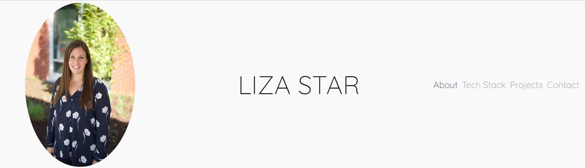
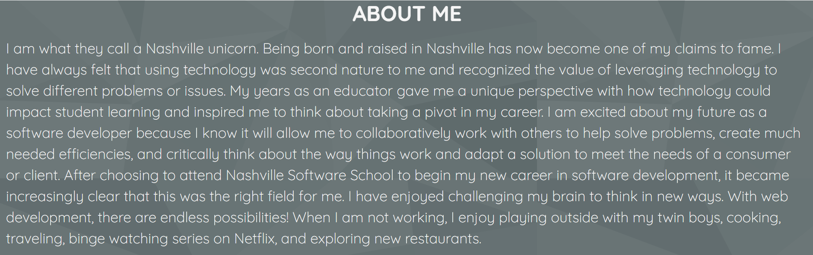
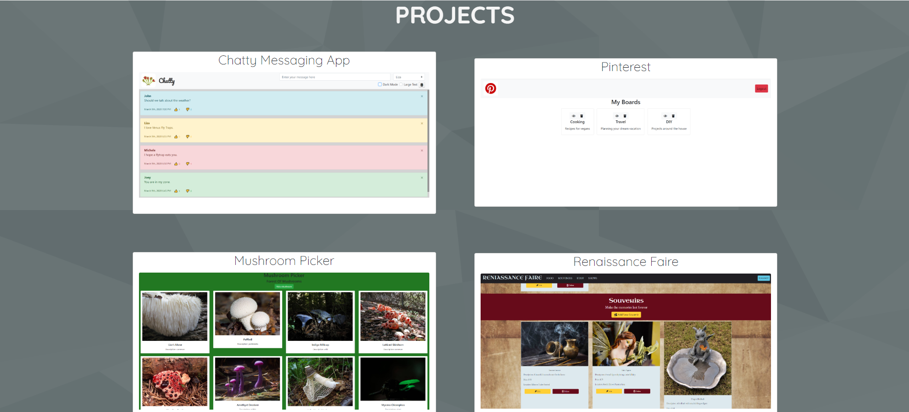

# Personal Bio Site

## Description
This site allow users to view and explore my work created throughout the year at NSS.  This website contains a little get to know me and my journey towards becoming a softwarer developer.  It also shows some of the technologies I have used and four projects I have completed thus far.  There is also contact information at the bottom for people to reach out and connect!  
## Screenshots

## How to Run
1. Clone down this repo
1. Make sure you have  http-serve installed via npm. If not, get it [HERE](https://npmjs.com/package/http-server).
1. On your command line run `hs -p 9999`
1. In your browser go to `http://localhost:9999`
 or 
Run Site with Deploy Link: 
liza-star-portfolio.web.app
